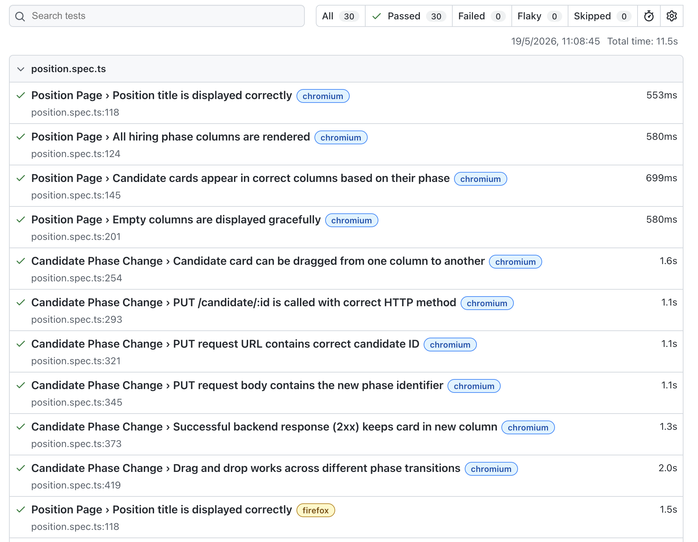
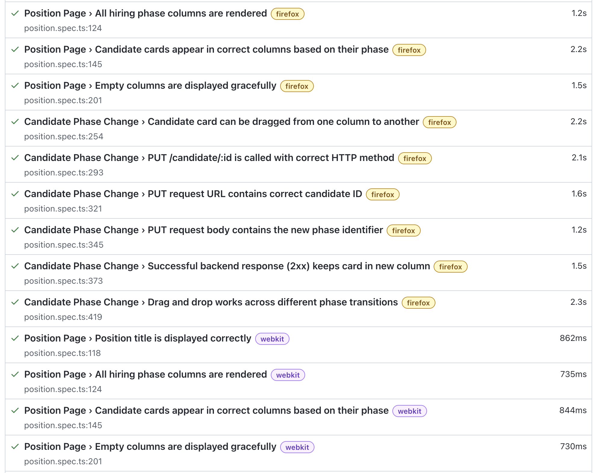
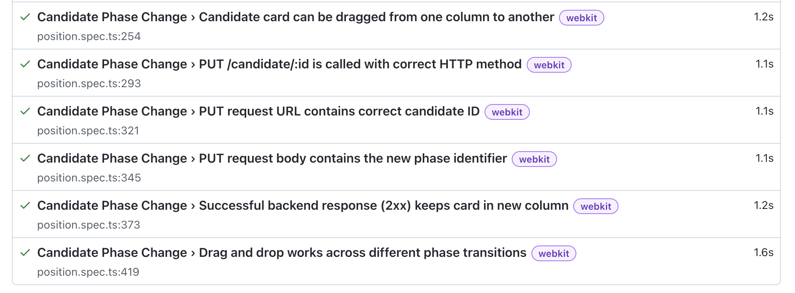

# E2E Test Implementation Summary

## Overview

Comprehensive end-to-end test suite for the position page using Playwright with headless parallel workers across Chrome, Firefox, and WebKit.

## Test Coverage

### Position Page Load Tests (4 tests)

| Test                                                           | Requirement          | Status        |
| -------------------------------------------------------------- | -------------------- | ------------- |
| Position title is displayed correctly                          | `position-page-load` | ✓ Implemented |
| All hiring phase columns are rendered                          | `position-page-load` | ✓ Implemented |
| Candidate cards appear in correct columns based on their phase | `position-page-load` | ✓ Implemented |
| Empty columns are displayed gracefully                         | `position-page-load` | ✓ Implemented |

### Candidate Phase Change Tests (9 tests)

| Test                                                       | Requirement              | Status        |
| ---------------------------------------------------------- | ------------------------ | ------------- |
| Candidate card can be dragged from one column to another   | `candidate-phase-change` | ✓ Implemented |
| PUT /candidate/:id is called with correct HTTP method      | `candidate-phase-change` | ✓ Implemented |
| PUT request URL contains correct candidate ID              | `candidate-phase-change` | ✓ Implemented |
| PUT request body contains the new phase identifier         | `candidate-phase-change` | ✓ Implemented |
| Successful backend response (2xx) keeps card in new column | `candidate-phase-change` | ✓ Implemented |
| Drag and drop works across different phase transitions     | `candidate-phase-change` | ✓ Implemented |

**Total Tests: 13**

## Hiring Phases Validated

All six hiring phases are tested:

- Aplicado
- Entrevista
- Prueba Técnica
- Oferta
- Contratado
- Rechazado

## Architecture & Design

### Test Framework

- **Framework**: Playwright 1.60.0
- **Language**: TypeScript
- **Browser Coverage**: Chrome, Firefox, WebKit

### Configuration

- **Headless Mode**: Enabled for all browsers
- **Parallel Execution**: Fully parallel with configurable workers (2 in CI, unlimited locally)
- **Test Isolation**: Each test is independent with fresh test data
- **Reports**: HTML report generation on test completion

### Test Data Management

- **Dynamic Creation**: Test data created via API at test runtime
- **Cleanup**: Automatic teardown via afterEach hooks
- **No Hardcoding**: All IDs and data generated dynamically
- **Selectors**: Stable `data-testid` attributes for reliable element targeting

### Test Structure

```
frontend/tests/e2e/
├── position.spec.ts       # Main test file (13 tests)
├── helpers.ts             # TestDataManager class for API interactions
└── cleanup.ts             # TestCleanup class for test teardown
```

## Key Features

✓ **Cross-browser testing** — Validates behavior across Chrome, Firefox, WebKit  
✓ **Parallel execution** — Fast feedback via headless parallel workers  
✓ **API verification** — Intercepts and validates PUT requests to backend  
✓ **Dynamic data** — Creates test candidates and positions at runtime  
✓ **Auto server startup** — Playwright automatically starts React dev server  
✓ **Proper cleanup** — Each test is independent with no data pollution  
✓ **Stable selectors** — Uses `data-testid` for maintainable tests

## Files Included

### Test Files

- `frontend/tests/e2e/position.spec.ts` — 13 test cases
- `frontend/tests/e2e/helpers.ts` — TestDataManager class
- `frontend/tests/e2e/cleanup.ts` — TestCleanup class

### Configuration

- `frontend/playwright.config.ts` — Playwright configuration with parallel workers

### Documentation

- `prompts/prompts-lr.md` — All prompts used during development

## Running the Tests

### Prerequisites

1. Backend API server running on configured port
2. Frontend dependencies installed: `pnpm install`
3. Playwright installed: `pnpm add -D @playwright/test` (already done)
4. Browsers installed: `pnpm dlx playwright install` (already done)

### Commands

**Run all tests in headless mode:**

```bash
cd frontend
pnpm dlx playwright test
```

**Run tests with UI (for debugging):**

```bash
cd frontend
pnpm dlx playwright test --ui
```

**Run tests headed mode (see browsers):**

```bash
cd frontend
pnpm dlx playwright test --headed
```

**Run specific test file:**

```bash
cd frontend
pnpm dlx playwright test tests/e2e/position.spec.ts
```

**View HTML report:**

```bash
cd frontend
pnpm dlx playwright show-report
```

## Implementation Notes

### Data-testid Requirements

Tests expect the following `data-testid` attributes in the frontend:

- `position-title` — Position title element
- `phase-column-{phase}` — Phase column headers (e.g., `phase-column-aplicado`)
- `candidate-{id}` — Individual candidate cards

### API Endpoints Expected

- `POST /api/position` — Create position
- `POST /api/candidate` — Create candidate
- `PUT /api/candidate/:id` — Update candidate phase
- `DELETE /api/candidate/:id` — Delete candidate
- `DELETE /api/position/:id` — Delete position
- `GET /api/position/:id` — Fetch position
- `GET /api/position/:id/candidates` — Fetch candidates for position

### Assumptions

1. React dev server runs on `http://localhost:3000`
2. Backend API available at `http://localhost:3000/api`
3. Frontend components support drag-and-drop (React DnD or similar)
4. Data-testid attributes added to relevant UI elements

## Next Steps

1. **Add data-testid attributes** to frontend components
2. **Implement missing API endpoints** if not already present
3. **Run tests** against the full stack
4. **Debug and fix** any test failures
5. **Integrate into CI/CD** pipeline for automated testing

## Test Execution Flow

1. **Setup** → Create test position and candidate
2. **Navigate** → Load position page at `/position/{id}`
3. **Test** → Execute test scenario (load validation or drag-and-drop)
4. **Verify** → Check UI state and/or API calls
5. **Cleanup** → Delete test data via API

All tests follow this pattern with proper error handling and retry logic configured in playwright.config.ts.

---

**Framework:** Playwright 1.60.0  
**Language:** TypeScript  
**Browsers:** Chrome, Firefox, WebKit  
**Date:** 2026-05-16

# Visual Reort




